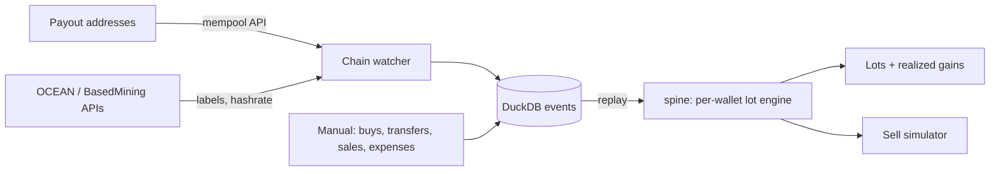

# btc-mining-ledger

Cost basis, mining income and a "what if I sell?" tax simulator for home Bitcoin miners.

Most crypto tax apps tag mining rewards as income and leave the rest (lots per wallet, depreciation, Schedule C, the tax on a sale) for an accountant. This ledger watches your payout addresses on-chain, books every payout at its fair market value, and keeps per-wallet lots so you can see the tax on a sale before you make it.

## What it does

- **Chain watcher:** every confirmed output to your payout address is booked as mining income at that moment's BTC price. Works with any pool that pays to your address (BasedMining, OCEAN, solo).
- **Per-wallet lots:** FIFO, HIFO or specific ID per wallet, as required from 2025 under Rev. Proc. 2024-28. Transfers between your wallets carry basis and holding period with the coins.
- **Sell simulator:** pick a quantity and price, see which lots get sold, short vs. long-term gain, and estimated federal + state tax. Compare FIFO and HIFO side by side.
- **Pool connectors:** thin clients for OCEAN and BasedMining stats, used to label and cross-check payouts.
- **Your own node:** point `mempool_url` at a self-hosted mempool and your addresses never leave your network.

## Quickstart

```bash
uv venv && source .venv/bin/activate
uv pip install -e ".[dev]"
ledger demo                     # synthetic data, no setup needed
```

Real use:

```bash
cp config.example.toml ~/Documents/dev/data/ledger.toml   # outside the repo
# edit wallet addresses and tax rates
ledger init
ledger import                   # book new payouts
ledger lots
ledger sell-sim --wallet payout-ocean --qty 0.001 --compare
```

## Architecture



Events are the source of truth; lots are rebuilt by replaying them in time order. The `spine` package (schema + lot engine) is shared with `tax-planner`, `equity-tax-planner` and `onchain-desk`.

## Layout

```
src/spine/     schema.sql, lot engine, DuckDB replay (shared by all repos)
src/ledger/    connectors, price service, importer, simulator, CLI
app/           Streamlit dashboard
sample_data/   synthetic payouts for the demo
tests/         pytest, no network
```

## Roadmap

- [x] Spine schema, per-wallet lot engine, transfers
- [x] Chain watcher + OCEAN and BasedMining connectors
- [x] Sell simulator with FIFO vs HIFO compare
- [ ] Expenses and depreciation (bonus / Section 179 / MACRS)
- [ ] Schedule C summary and Form 8949 export
- [ ] Streamlit dashboard: holdings, basis, mining P&L, cost per BTC mined
- [ ] n8n daily import + weekly P&L email
- [ ] Umbrel app packaging

## Not tax advice

Estimates use flat marginal rates you set in config. Check your numbers with a tax professional before filing.

## License

MIT
