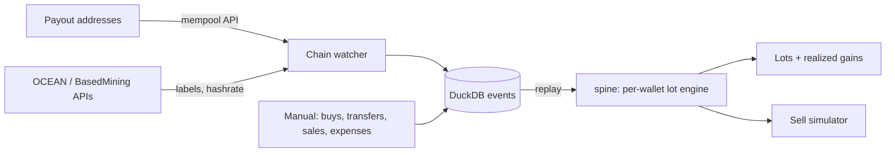

# Architecture

## Data flow

Two packages live in `src/`:

- `spine`: the schema (`schema.sql`), the lot engine (`lots.py`) and DuckDB replay (`db.py`). It is shared by tax-planner, equity-tax-planner and onchain-desk, so it holds no ledger or CLI code.
- `ledger`: connectors (chain, pools), the price service, the importer, the sell simulator and the Typer CLI.

## Event replay

Events are the source of truth. Lots are never stored.

The event tables are `income_events`, `purchases`, `transfers` and `disposals`. (`expenses` and `fixed_assets` feed reports, not lots.) Each row is written once and never edited. The chain watcher dedupes payouts on `txid:vout`, so re-running `ledger import` is safe.

`spine.db.replay(con, as_of=None)` rebuilds state:

1. Load every wallet's lot method (`fifo`, `hifo` or `spec_id`) from `wallets`.
2. Read all four event tables in one `UNION ALL`, ordered by timestamp, then a tie-break rank, then event id.
3. Feed each event into a fresh `LotEngine`:
   - income or buy: `add_lot` in that wallet. Mining income uses FMV at receipt as basis.
   - transfer: `transfer` moves lots between wallets with their basis and acquisition date.
   - disposal: `dispose` relieves lots by the wallet's method and returns one `LotRelief` per lot touched.
4. Stop at `as_of` if given. Return the engine (open lots) and the list of reliefs (realized gains).

Same-timestamp order is fixed: acquisitions (rank 0), then transfers (1), then disposals (2). So a payout and a sale in the same block never fail on balance, and the result is deterministic.

### Why replay instead of stored lots

- One place for lot logic. Change a method or fix a bug, re-run, and every report updates.
- Point-in-time views for free (`as_of`), which the tax planner needs for year-end and quarterly numbers.
- Auditable: every lot and every gain traces back to rows you can read.
- Cost is small. A home miner has thousands of events, not millions, so a full replay is cheap.

## Tax rules in the engine

- Lots are per wallet, as required from 2025 under Rev. Proc. 2024-28. The method is set per wallet.
- Holding period: long term only if disposed after the one-year anniversary (`holding_term`). Feb 29 acquisitions roll to Feb 28.
- Transfers between your own wallets are not taxable. The network fee's basis is added to the received lots. This is a documented choice; some advisers treat the fee as a small disposal instead. Revisit if guidance or H.R. 10357 changes it.
- Disposal fees reduce proceeds. Net proceeds are split pro rata across the lots relieved.
- All money and BTC math uses `Decimal`. BTC to 8 places, USD to cents at the edges.

## Data boundaries

- Real config and the DuckDB file live in `~/Documents/dev/data/`, outside every repo. `LEDGER_CONFIG` points at it.
- Tests never hit the network. Pool API shapes are pinned with fixtures in `tests/fixtures/`.
- gitleaks runs in pre-commit and CI.
